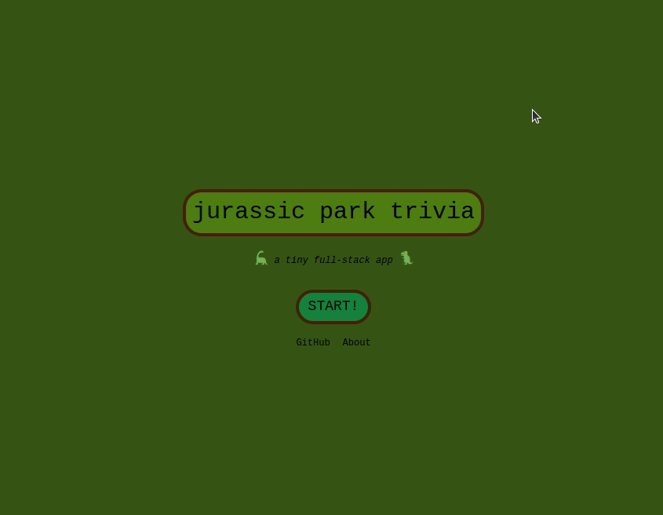
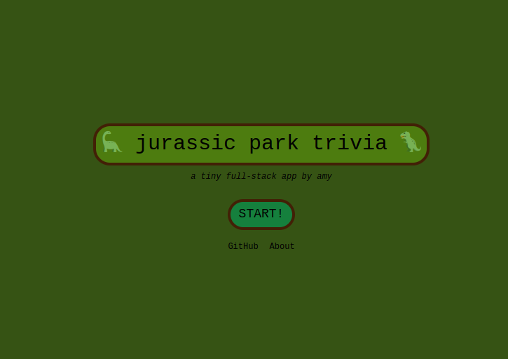
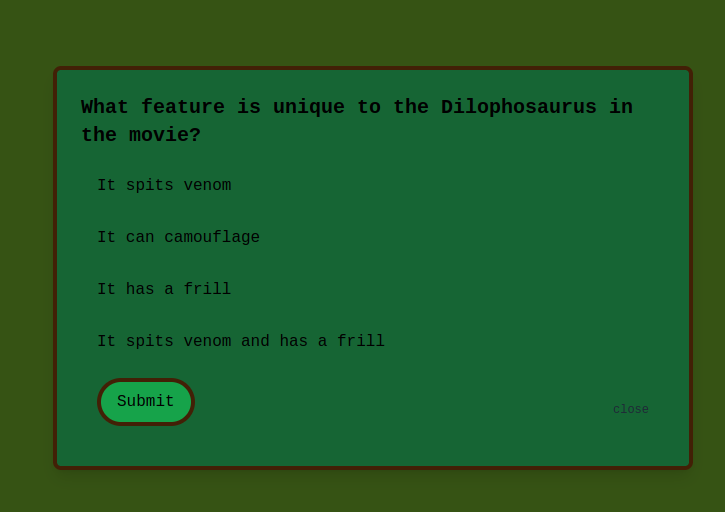

# 🦕 Jurassic Park Trivia 🦖




This project provides a json dataset, an API with 2 endpoints, and a front end interface for trivia questions related to the Jurassic Park movie.  I wanted to practice writing and deploying simple Next.js API endpoints to Vercel, and I ended up continuing on and adding a cute React interface, styled with Tailwind, for this simple trivia game.

## Future Features

- Providing feedback on the correct answers to the questions the user guessed incorrectly
- Additional API endpoint to retrieve a *custom* number of questions
- Adding additional trivia questions for more variety (currently 40)

## API Endpoints

#### 1. Get 10 Random Trivia Questions

- **Endpoint**: `/api/triviagame`
- **Method**: `GET`
- **Description**: Returns a random selection of 10 trivia questions.
- **Response Format**: An array of objects, each representing a trivia question with its ID, text, options, and answer.

#### 2. Get Trivia Question by ID

- **Endpoint**: `/api/trivia/[id]`
- **Method**: `GET`
- **Description**: Retrieves a specific trivia question by its ID.
- **Parameters**:
  - `id` (integer): The unique identifier of the trivia question.
- **Response Format**: An object representing the trivia question with its ID, text, options, and answer. If no question is found for the requested ID, a 404 error is returned.

## Front End


The front-end for this app is built with React and Next.js (Typescript), and it uses Tailwind CSS for styling.

### Features

- **Start Game**: Users can initiate a new trivia game session.
- **Trivia Questions**: Presents 10 random trivia questions fetched from the API.
- **Answer Selection**: Users can select their answer from the given options for each question.
- **Score Calculation**: Tracks the user's responses and calculates the score based on correct answers.
- **Result Display**: At the end of the game, displays the user's score and offers an option to restart the game.


## Getting Started

To run the full stack app locally:

```
npm install
npm run dev
```

The app will be available for you to interact with at **localhost:3000**.

Alternatively, you can view the deployed version of this app at https://jurassicparktrivia.vercel.app 





